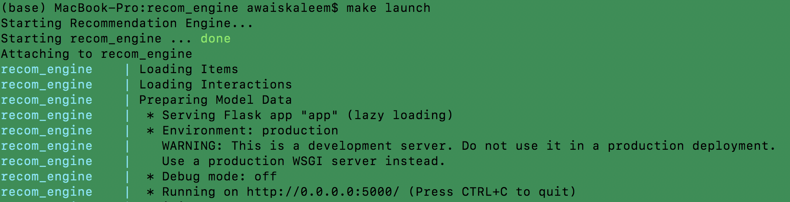

# Case Study for Klarna Interview
### E-Commerce-Recommendation-Engine

The project build on e-commerce user visit data and creates a recommendation engine. Target predictions are items recommended for a particular use. Project also supports batch file as input and output in /output directory.

## Project Organization

```
.
├── README.md
├── app.py
├── Dockerfile
├── docker-compose.yml
├── Makefile
├── artifacts (These will be loaded once trained)
│   ├── cate_enc_dict_feature.pickle
│   ├── cate_enc_dict_itemid.pickle
│   ├── cate_enc_dict_visitorid.pickle
│   ├── model_with_items.pickle
│   ├── model_without_items.pickle
│   ├── rate_matrix_all.npz
│   ├── rate_matrix_feature.npz
│   ├── rate_matrix_test.npz
│   └── rate_matrix_train.npz
├── data (This is where following data files should be placed)
│   ├── category_tree.csv
│   ├── events.csv
│   ├── item_properties_part1.csv
│   ├── item_properties_part2.csv
│   └── predictions.csv
├── docs (Exploratory data analysis and other documentations)
│   └── eda.ipynb
├── etl (extraction, transform, and load files)
│   ├── feature_extractor.py
│   └── preprocessing.py
├── output (results will be saved here provided input is a file)
│   └── results.csv
├── requirements.txt
└── src (this is where model code files are)
    ├── model.py
```

## Requirements

Make sure you have the following requirements installed:

* `python`
* `docker`
* `docker-compose`

Also, make sure that you provide enough resources to the docker machine if you are on windows or MacOS.

## Data Setup

This project uses publically available data set on an e-commerce website. The data is download-able from following link https://www.kaggle.com/retailrocket/ecommerce-dataset

If the data is already downloaded then copy the *.csv files into `./data` folder. Following files are expected for this project to work:
```
├── data 
│   ├── category_tree.csv
│   ├── events.csv
│   ├── item_properties_part1.csv
│   ├── item_properties_part2.csv
│   └── predictions.csv [optional for batch input]
```


## Project Environment Setup

You can use the makefile to start the docker services in the background. At any point in time if you're not sure about the comment type in ```make help``` to display a list of options available. To setup whole API environment, simply type:

```make build```

This will build up docker image and launch it.
If you've already built it before and want to straight up launch your API, type:

```make launch```



### Model Training
To train the model

```make train```

### Endpoint Predictions
Get N item_id recommendations for a given user_id by 

```make predict user_id=123455``` 

```make predict user_id=123455 N=7```  


Note that if the user id is known, it will output existing knowledge and recommendations. If user is new and never seen before (from model's point of view), it will output most popular items, currently known.

### Batch Predictions
To use file based predictions, you need "prediction.csv" inside ./data folder before you launch. A file named "results.csv" will be created as a result of batch predictions.

```make predict_file```

### ShutDown

Simply type:

```make shutdown```
